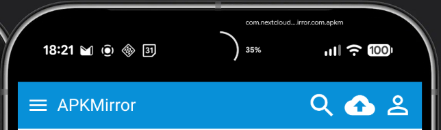

# Punch-hole Download Progress

Xposed module that displays download progress as an animated ring around the camera cutout. Hooks into SystemUI notifications to monitor downloads from browsers and the system download manager.


<div align="center">
  
</div>

## Features

- **Cutout Integration:** Renders progress rings directly around the device camera cutout using the native Android Display Cutout API.
- **Native Tracking:** Out-of-the-box monitoring for Android Download Manager, Bluetooth transfers, and major browser engines (Chrome, Firefox, etc.).
- **Universal Interception:** Optional tracking mode to display progress for any active notification containing a standard progress bar.
- **Concurrent Management:** Logic for handling multiple simultaneous transfers, defaulting to the task with the highest progress.
- **Granular Customization:** Individual controls for ring thickness, cutout spacing, opacity, and color hex codes.
- **Completion Effects:** Selectable animations for finished tasks, including snap, pulse, and segmented sweep effects.
- **Duration Thresholds:** Configurable behavior for fast downloads with options to guarantee minimum visibility or skip the indicator entirely.
- **System Awareness:** Integrated haptic feedback and automatic dimming or disabling when Battery Saver is active.

## Requirements

- Android 12 (API 31) or higher
- [LSPosed](https://github.com/JingMatrix/LSPosed) (JingMatrix fork recommended) or [LSPosed Next](https://github.com/mywalkb/LSPosed_mod)
- Device with camera cutout (punch-hole or pill-shaped)

## Installation

1. Install and enable the module in LSPosed.
2. Configure the scope:
   - `com.android.systemui` – Shows the download progress ring overlay.
3. Reboot your device.

## Build

```bash
git clone --recurse-submodules https://github.com/hxreborn/punch-hole-download-progress.git
cd punch-hole-download-progress
./gradlew buildLibxposedApi
./gradlew assembleRelease
```

Requires JDK 21 and Android SDK. Configure `local.properties`:

```properties
sdk.dir=/path/to/android/sdk

# Optional signing
RELEASE_STORE_FILE=<path/to/keystore.jks>
RELEASE_STORE_PASSWORD=<store_password>
RELEASE_KEY_ALIAS=<key_alias>
RELEASE_KEY_PASSWORD=<key_password>
```

## License

<a href="LICENSE"></a>

This project is licensed under the GNU General Public License v3.0 – see the [LICENSE](LICENSE) file for details.
